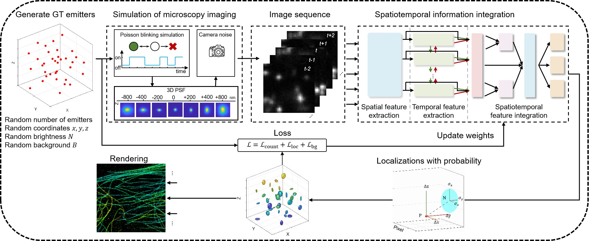

# SRST

 

## Introduction

Single-molecule localization microscopy (SMLM) is a powerful imaging technique that surpasses the diffraction limit of light by computationally localizing individual fluorescent molecules. However, achieving sufficient spatial resolution in SMLM requires extensive frame acquisition, limiting temporal resolution. Increasing the density of fluorescent molecules is a common strategy to enhance temporal resolution, but this often results in overlapping point spread functions (PSFs) and computational challenges in distinguishing adjacent molecules.

We developed a deep learning-driven approach, termed super-resolution spatiotemporal information integration (SRST), for the precise three-dimensional localization of ultra-high-density molecules.

## Setup

Clone the repo and build the python environment.

```
git clone https://github.com/XuLab-BIT/SRST.git
conda env create -f environment.yml
conda activate srst_env
```

## Training

Train model

```
python train.py
```

You can train networks that process different data by modifying the import file link in the python file. The modifiable include : 

- param_file: Set camera parameters, training data parameters and network hyperparameters. 
- calibration_file:  Set the PSF.

## Fitting

Fitting.ipynb provides the function of fitting the original data to generate super-resolution reconstruction. It is necessary to provide a trained network and data to be fitted.

## Acknowledgements

This implementation is based on code from several repositories.


- [DECODE](https://github.com/TuragaLab/DECODE)
- [SMAP](https://github.com/jries/SMAP)
- [SplinePSF](https://github.com/TuragaLab/SplinePSF)
